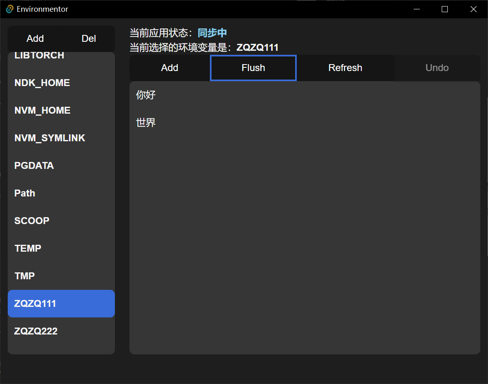

# Environmentor
[English](./README.md) | [中文](./README-zh.md)

全局环境变量管理器

+ 无UI组件库依赖，纯净开发
+ 大量Rust后端处理，让此repo充满技术感
+ **Based on [tauri](https://github.com/tauri-apps/tauri)**

## 功能

1. 基本的增删改查和排序，从文件路径获取值
2. undo，用于防止自己改了但是不知道改了什么
3. (v0.2)用户可选的扫盘，自动发现潜在的环境变量，供用户选择（比如：ffmpeg一般都会被格式工厂包含，但是你不能在命令行直接用，因为它不属于环境变量）

## 使用方法

1. 增删改查直到你想要的结果

2. 点击flush，以同步至系统

### 额外

3. 扫盘，以观察文件夹大小。

+ caching: 会生成csv文件在app目录下，加速下次扫描。

目前只支持D盘全盘扫描，后续会支持更细粒度的控制策略。

## 碎碎念

目前只支持windows，用法跟原生的一模一样

目前为了安全考虑只开放了操作用户环境变量的权限

