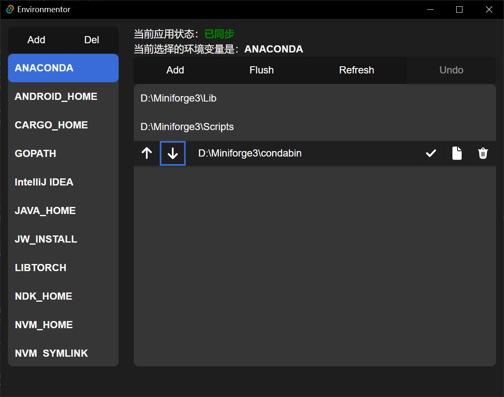
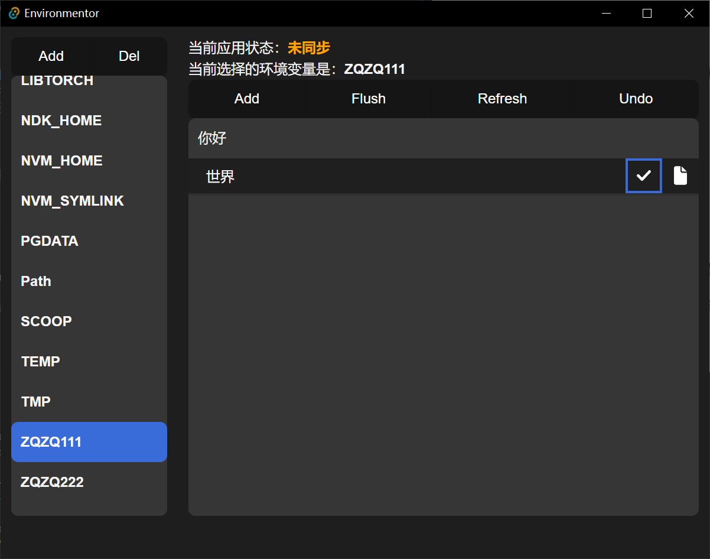
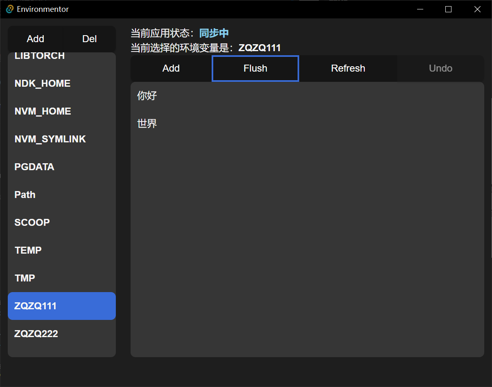
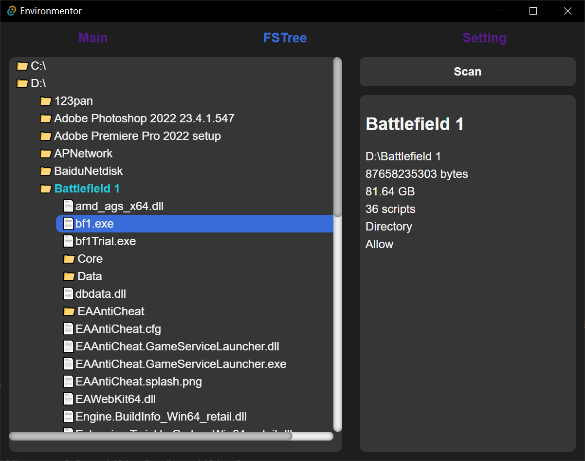

# Environmentor
[English](./README.md) | [中文](./README-zh.md)

Global environment variable manager

+ No UI component library dependencies, **keep purity**
+ Focus on Rust processing, granting this repo with an air of **elegance**
+ **Based on [tauri](https://github.com/tauri-apps/tauri)**

## Features

1. basic CURD, ordering, and `Find in File Explorer`
2. undo, in case you forget what you have done
3. (v0.2)optional scanning your disk, in order to find potential or undetected variables (ex. ffmpeg is always contained by **Format Factory** but you generally cannot get access to it directly in command line)

## Usage

1. CURD until you feel good

2. Flush to the disk

### Extras

3. Scan the disk to extract information.

+ caching: It will generate CSV files in the app directory to speed up the next scan.

At present, only full disk scanning is supported for D drives, and finer grained control strategies will be supported in the future.
