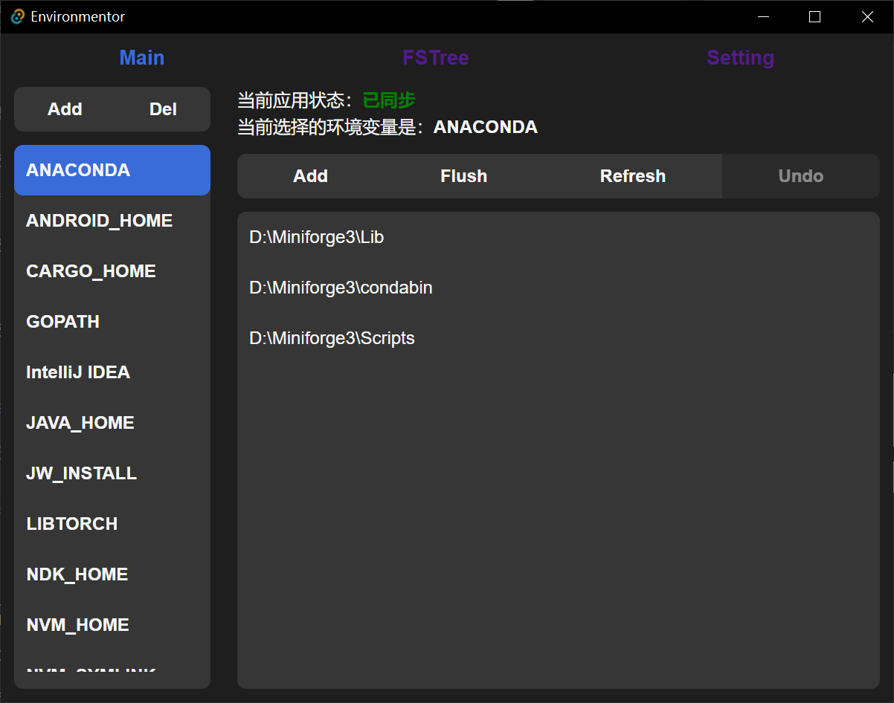

# Environmentor

**Based on [tauri](https://github.com/tauri-apps/tauri)**

这是一个全局环境变量管理器

## 功能

1. 基本的增删改查和排序
2. 直接从文件路径获取值
3. undo，用于防止自己改了但是不知道改了什么

## 使用方法

1. 增删改查直到你想要的结果

2. 点击flush，以同步至系统

## v0.2 extra

支持扫盘，以观察文件夹大小。

+ caching: 会生成csv文件在app目录下。

目前只支持D盘全盘扫描，后续会支持更细粒度的控制策略。

## 碎碎念

目前只支持windows，用法跟原生的一模一样

目前为了安全考虑只开放了操作用户环境变量的权限

